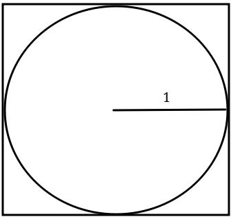

# First method
The general equation to find the area of this circle below is \

And the general equation to find the area of this triangle below is\
\

Say a and b both equal to r.

Say there're many triangles which inscribe in a circle and are exactly congruent just like this:\

Say n is the amount of triangles.\
Then, sum of the areas of the triangles is\

When n converges to infinity, it will be the area of the circle.\
In mathematical expression, it is\

Since they're same,\

And finally,\

However, we have to use pi in calculation of sine because python's sine method uses radians.\
So what we should do is to use Bhaskara I's sine approximation formula.\
It is remarkably accurate in range from 0 deg to 180 deg but not exact.\
n converges to infinity in our formula, so degree we should calculate will converge to 0, which means we can use it.\

Bhaskara I's sine approximation formula is defined as below.\
}%20{40500%20-%20x%20(180%20-%20x)})

# Second method
\
Say there's a circle is inscribing in a square.\
The radius of the circle is 1, so the side length of the square is 2.\
We're going to put many many dots on the square.\
Say N is the number of dots on the square and M is the number of dots on the circle.\
When we put enough dots, then N represents the area of the square and M represents the area of the circle.\
Then,\
\
\
Finally,\

# Third method
The Riemann Zeta function is defined as\
%20=%20\sum%20_{n%20=%201}%20^{\infty}%20{n%20^%20{-s}}%20=%20\sum%20_{n%20=%201}%20^{\infty}%20\frac%201%20{n%20^%20s})\
And\
%20=%20\frac%20{\pi%20^%202}%206)\
%20=%20\pi%20^%202)\
})\
Finally,\

