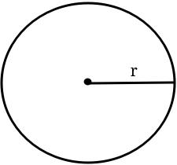
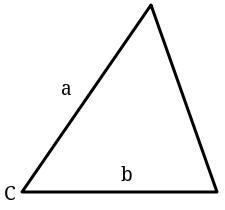
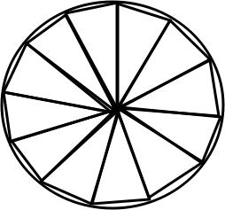

The general equation to find the area of this circle below is

And the general equation to find the area of this triangle below is

Say there're many triangles which inscribe in a circle and are exactly congruent just like this:

Say n is the amount of triangles.
Then, sum of the areas of the triangles is

When n converges to infinity, it will be the area of the circle.
In mathematical expression, it is

Since they're same,

And finally,

